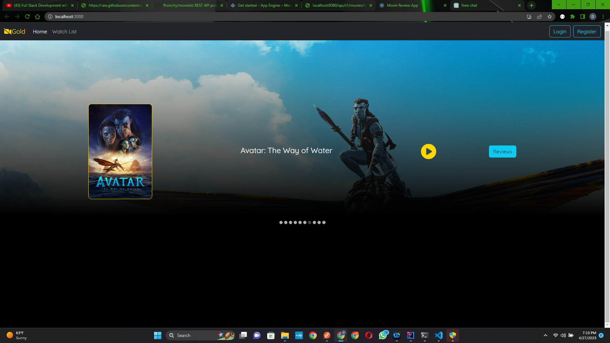

# Movie Review App

A web application for movie enthusiasts to browse,, and write reviews of their favorite films. Movies are displayed on a carousel tab and users can select a movie to see details, watch a trailer, and write a review.

## Features

- Browse a catalog of movies stored in MongoDB
- Read reviews written by other users
- Write your own reviews and rate movies 
- Watch movie trailers by clicking the play button
- Select movies from the carousel tab

## Technologies Used

- Spring Boot for the backend
- React.js for the frontend
- MongoDB for the database
- Bootstrap for the UI design

## Getting Started

To get started with the movie review app, follow these steps:

1. Clone this repository to your local machine .
2. Install the necessary dependencies by running `npm install` in the `client` directory and `mvn install` in the `server` directory.
3. Start the backend server by running `mvn spring-boot:run` in the `server` directory.
4. Start the frontend development server by running `npm start` in the `client` directory.

## MongoDB Database Setup

1. Install MongoDB on your local machine.
2. Create a database called `movie_review_app`.
3. Create a collection called `movies`.
4. Import the movie data into the `movies` collection. You can use the data provided in the `data/movies.json` file.
5. Update the `application.properties` file in the `server/src/main/resources` directory with your MongoDB connection details.

## Contributing

Contributions to the movie review app are always welcome! If you find a bug, want to suggest a new feature, or just have a question, please open an issue on this repository. If you would like to contribute code, please fork this repository and submit a pull request. Some features like watchlist,login and registrations falls outside the current scope of this project.

## License

This project is licensed under the MIT License - see the LICENSE file for details.

## Acknowledgments

- This app was inspired by various movie review websites and apps.
